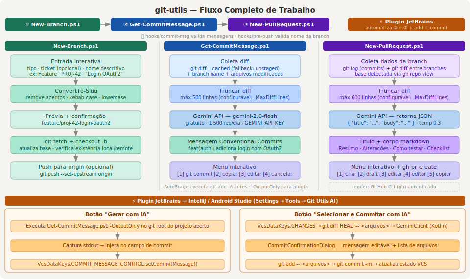

# git-commit-ai

Script PowerShell que gera mensagens de commit semântico automaticamente usando IA, a partir do diff do repositório atual.



## Funcionalidades

- Detecta automaticamente diff **staged** ou **unstaged**
- Envia o diff + nome da branch + arquivos alterados para o **Google Gemini 2.0 Flash** (gratuito, sem cartão de crédito)
- Gera mensagem seguindo o padrão **[Conventional Commits](https://www.conventionalcommits.org/)** em português
- Menu interativo: commitar direto, copiar para clipboard ou editar antes de commitar
- Truncagem configurável do diff para evitar exceder limites da API

## Pré-requisitos

- PowerShell 5.1 ou superior
- Git instalado e disponível no PATH
- Chave de API gratuita do Google Gemini

## Obtendo a API Key

1. Acesse [https://aistudio.google.com/app/apikey](https://aistudio.google.com/app/apikey)
2. Clique em **Create API Key**
3. Copie a chave gerada (não é necessário cartão de crédito)

> O modelo `gemini-2.0-flash` possui cota gratuita de **1.500 requisições/dia**.

## Instalação

Clone o repositório ou baixe o arquivo `Get-CommitMessage.ps1` diretamente.

Se necessário, libere a execução de scripts no PowerShell:

```powershell
Set-ExecutionPolicy -Scope CurrentUser RemoteSigned
```

## Configuração

Configure a API Key como variável de ambiente para não precisar informá-la a cada execução:

```powershell
# Sessão atual
$env:GEMINI_API_KEY = "sua_chave_aqui"

# Persistente (adicione ao seu $PROFILE)
[System.Environment]::SetEnvironmentVariable("GEMINI_API_KEY", "sua_chave_aqui", "User")
```

## Como usar

```powershell
# Uso básico — considera o que está no stage (git add feito previamente)
.\Get-CommitMessage.ps1

# Informando a chave diretamente
.\Get-CommitMessage.ps1 -ApiKey "sua_chave_aqui"

# Executa git add -A automaticamente antes de gerar o diff
.\Get-CommitMessage.ps1 -AutoStage

# Aumenta o limite de linhas do diff enviado para a IA
.\Get-CommitMessage.ps1 -MaxDiffLines 800

# Combinando parâmetros
.\Get-CommitMessage.ps1 -AutoStage -MaxDiffLines 800
```

### Menu interativo

Após gerar a mensagem, o script exibe:

```
  ─────────────────────────────────────────
   Mensagem de commit gerada:
  ─────────────────────────────────────────

  feat(auth): adiciona validação de token JWT na rota de login

  ─────────────────────────────────────────

  O que deseja fazer?
  [1] Usar esta mensagem e fazer o commit
  [2] Copiar para a área de transferência
  [3] Editar antes de commitar
  [4] Cancelar
```

## Parâmetros

| Parâmetro      | Tipo    | Padrão                  | Descrição                                              |
|----------------|---------|-------------------------|--------------------------------------------------------|
| `-ApiKey`      | string  | `$env:GEMINI_API_KEY`   | Chave de API do Google Gemini                          |
| `-MaxDiffLines`| int     | `500`                   | Limite de linhas do diff enviado para a IA             |
| `-AutoStage`   | switch  | —                       | Executa `git add -A` antes de coletar o diff           |

## Exemplos de mensagens geradas

```
feat(checkout): adiciona suporte a pagamento via PIX
fix(api): corrige timeout na requisição de consulta de CEP
refactor(auth): extrai lógica de validação para serviço dedicado
docs(readme): atualiza instruções de instalação no Windows
chore(deps): atualiza dependências para versões mais recentes
```

---

# New-PullRequest.ps1

Script PowerShell que gera o título e o corpo de um Pull Request automaticamente usando IA, e o abre diretamente no GitHub via **GitHub CLI (`gh`)**.

## Funcionalidades

- Compara a branch atual com a branch base (detectada automaticamente)
- Envia ao Gemini: diff entre branches, histórico de commits e arquivos modificados
- Gera **título** (Conventional Commits) e **corpo completo em markdown** com seções de resumo, alterações, como testar e checklist
- Cria o PR via `gh pr create` com suporte a draft, revisores e labels
- Abre arquivo temporário no editor para revisão manual antes de enviar

## Pré-requisitos adicionais

- **GitHub CLI** instalado e autenticado: [https://cli.github.com](https://cli.github.com)

```powershell
# Instalar via winget
winget install GitHub.cli

# Autenticar
gh auth login
```

## Como usar

```powershell
# Uso básico — detecta branch base e cria PR interativamente
.\New-PullRequest.ps1

# Especificar branch base e criar como draft
.\New-PullRequest.ps1 -BaseBranch develop -Draft

# Com revisores e labels
.\New-PullRequest.ps1 -Reviewer "joao,maria" -Label "enhancement,backend"

# Sem fazer push da branch (já está no remote)
.\New-PullRequest.ps1 -NoPush

# Aumentar limite do diff
.\New-PullRequest.ps1 -MaxDiffLines 1000
```

### Menu interativo

```
  O que deseja fazer?
  [1] Criar PR agora
  [2] Criar PR como Draft
  [3] Editar título antes de criar
  [4] Abrir no editor (salva em arquivo temporário)
  [5] Copiar corpo para área de transferência
  [6] Cancelar
```

## Parâmetros

| Parâmetro       | Tipo   | Padrão                | Descrição                                                  |
|-----------------|--------|-----------------------|------------------------------------------------------------|
| `-ApiKey`       | string | `$env:GEMINI_API_KEY` | Chave de API do Google Gemini                              |
| `-BaseBranch`   | string | detectado via `gh`    | Branch de destino do PR                                    |
| `-Draft`        | switch | —                     | Cria o PR como rascunho                                    |
| `-Reviewer`     | string | —                     | Revisores separados por vírgula (ex: `"joao,maria"`)       |
| `-Label`        | string | —                     | Labels separados por vírgula (ex: `"bug,enhancement"`)     |
| `-MaxDiffLines` | int    | `600`                 | Limite de linhas do diff enviado para a IA                 |
| `-NoPush`       | switch | —                     | Não faz push da branch antes de criar o PR                 |

## Exemplo de PR gerado

**Título:**
```
feat(auth): adiciona autenticação via OAuth2 com GitHub
```

**Corpo:**
```markdown
## Resumo
Implementa o fluxo de autenticação OAuth2 utilizando o provedor GitHub,
permitindo que usuários façam login com suas contas existentes sem necessidade
de cadastro adicional.

## Alterações
- Adicionado provider OAuth2 no módulo de autenticação
- Criada rota `/auth/github/callback` para receber o token
- Atualizado middleware de sessão para persistir dados do usuário

## Como testar
1. Configure `GITHUB_CLIENT_ID` e `GITHUB_CLIENT_SECRET` no `.env`
2. Acesse `/login` e clique em "Entrar com GitHub"
3. Autorize o aplicativo e verifique o redirecionamento

## Checklist
- [ ] Código revisado pelo autor
- [ ] Testes adicionados/atualizados
- [ ] Documentação atualizada (se aplicável)
- [ ] Sem warnings ou erros de lint
```

---

## Estrutura do repositório

```
git-commit-ai/
├── Get-CommitMessage.ps1   # Gera mensagem de commit semântico
├── New-PullRequest.ps1     # Gera e abre PR no GitHub
├── commit_script_flow.svg  # Diagrama do fluxo
└── README.md
```

## Licença

MIT
